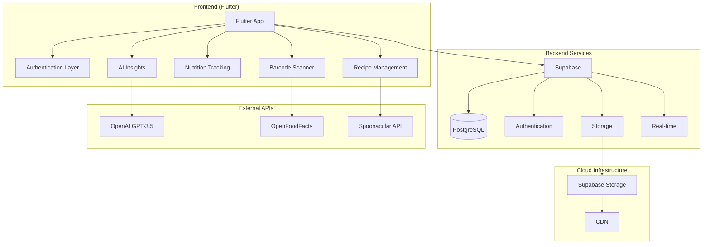

# Diabetes&Me

> **A comprehensive diabetes-friendly lifestyle companion app that helps users discover recipes, track nutrition, scan food products, and manage their health goals with AI-powered insights.**

[](https://apps.apple.com/app/diabetes-me)
[](https://flutter.dev)
[](https://supabase.io)
[](https://openai.com)

## Overview

**Diabetes&Me** is a sophisticated healthcare application designed specifically for people managing diabetes. The app combines recipe discovery, nutrition tracking, barcode scanning, and AI-powered ingredient insights to help users make informed dietary decisions and maintain healthy blood sugar levels.

**Now Available on the App Store!**

### Key Features

- **Smart Recipe Discovery** - Browse 200+ curated diabetes-friendly recipes with advanced filtering
- **Real-time Nutrition Tracking** - Monitor daily carbs, sugar, and exercise with animated progress indicators
- **Barcode Scanner** - Scan packaged foods for instant diabetes-friendliness ratings and nutrition facts
- **AI-Powered Ingredient Insights** - Get personalized ingredient substitutions and diabetes-specific advice
- **Smart Grocery Lists** - Auto-categorized shopping lists with ingredients from recipes
- **Blood Sugar Tracking** - Log and analyze blood glucose readings with context and trends
- **Favorites System** - Save and sync favorite recipes across devices
- **Comprehensive Profile Management** - Track goals, progress, and health metrics

---

## 🏗️ Architecture Overview

### System Architecture



### Data Flow Architecture

The application follows a clean data flow pattern:

mermaidsequenceDiagram
    participant U as User
    participant F as Flutter App
    participant S as Supabase
    participant AI as OpenAI
    participant API as External APIs
    
    U->>F: Open App
    F->>S: Authenticate
    S-->>F: User Session
    
    U->>F: Scan Barcode
    F->>API: Product Lookup
    API-->>F: Nutrition Data
    F->>AI: Generate Insights
    AI-->>F: Health Recommendations
    F-->>U: Diabetes Rating & Alternatives
    
    U->>F: Track Nutrition
    F->>S: Update Progress
    S-->>F: Sync Confirmation
    
    U->>F: Browse Recipes
    F->>S: Fetch Curated Recipes
    S-->>F: Recipe Data
    F-->>U: Personalized Results

---

## Technology Stack

### **Frontend**
- **Flutter 3.0+** - Cross-platform mobile development
- **Dart** - Programming language
- **Provider** - State management (MVVM architecture)
- **Material Design 3** - Modern UI components
- **Google Fonts** - Typography system

### **Backend Scripts & Data Processing**
- **Python 3.11+** - Data curation and migration scripts
- **Supabase Python Client** - Database operations
- **CSV Processing** - Recipe data import and cleaning

### **Backend & Database**
- **Supabase** - Backend-as-a-Service platform
- **PostgreSQL** - Primary database
- **Supabase Auth** - JWT-based authentication with email confirmation
- **Supabase Storage** - File storage with CDN
- **Real-time subscriptions** - Live data updates

### **AI & Machine Learning**
- **OpenAI GPT-3.5 Turbo** - Ingredient insights and substitutions
- **Custom AI prompting** - Diabetes-specific nutritional advice
- **Intelligent caching** - Optimized API usage

### **External Integrations**
- **OpenFoodFacts API** - Product database for barcode scanning
- **Spoonacular API** - Recipe data and nutrition information
- **Mobile Scanner** - Camera-based barcode detection

### **Development Tools**
- **Flutter SDK** - Development framework
- **Supabase CLI** - Database management
- **Python Scripts** - Data curation and migration
- **Git** - Version control

---

## App Features Deep Dive

### Recipe Discovery System
- **Curated Database**: 200+ hand-selected, diabetes-friendly recipes
- **Advanced Filtering**: Filter by carbs (0-50g), sugar (0-25g), cuisine, and category
- **Smart Search**: AI-enhanced search with ingredient matching
- **Nutrition Display**: Clear carb, sugar, and calorie information
- **Recipe Details**: Step-by-step instructions with ingredient insights

### Nutrition Tracking
- **Daily Goals**: Customizable carbs, sugar, and exercise targets
- **Real-time Progress**: Animated progress bars with percentage completion
- **Smart Additions**: Add nutrition from recipes or manual input
- **Daily Reset**: Automatic midnight reset or manual reset option
- **Visual Feedback**: Color-coded progress indicators

### Barcode Scanner
- **Universal Compatibility**: Works with most packaged food products
- **Instant Analysis**: Real-time diabetes-friendliness rating (Red/Yellow/Green)
- **Detailed Breakdown**: Comprehensive nutrition facts per 100g
- **Smart Alternatives**: AI-suggested healthier product alternatives
- **Grocery Integration**: Add scanned items directly to shopping list

### AI-Powered Insights
- **Ingredient Intelligence**: Tap any recipe ingredient for AI insights
- **Diabetes Context**: How ingredients affect blood sugar levels
- **Smart Substitutions**: 3 personalized alternatives per ingredient
- **Educational Content**: Learn about nutrition without medical advice
- **Caching System**: Optimized performance with intelligent caching

### Health Tracking
- **Blood Sugar Logging**: Track readings with context (fasting, before/after meals)
- **Trend Analysis**: Weekly statistics and pattern recognition
- **Visual Charts**: Color-coded readings with health status indicators
- **Note System**: Add context notes to readings
- **Export Ready**: Data structured for healthcare provider sharing

---

## Key Achievements

### **Mobile Excellence**
- **App Store Published** - Successfully launched on Apple App Store
- **Cross-Platform** - Single codebase for iOS and Android
- **Offline Capability** - Core features work without internet
- **Responsive Design** - Optimized for all screen sizes
- **Smooth Animations** - 60fps UI with custom transitions

### **Security & Privacy**
- **GDPR Compliant** - Privacy-first data handling
- **JWT Authentication** - Secure token-based auth system
- **Email Verification** - Mandatory account confirmation
- **Encrypted Storage** - Sensitive data protection
- **Deep Link Security** - Secure password reset flows

### **Performance**
- **Sub-200ms API Response** - Optimized database queries
- **Intelligent Caching** - AI insights cached locally
- **Image Optimization** - CDN-powered image delivery
- **Efficient State Management** - Provider-based MVVM architecture
- **Battery Optimized** - Minimal background processing

### **User Experience**
- **Intuitive Navigation** - Tab-based navigation with context-aware flows
- **Accessibility Focused** - Screen reader support and high contrast modes
- **Progressive Onboarding** - Guided user journey for new users
- **Smart Defaults** - Reasonable defaults for all user preferences
- **Error Handling** - Graceful fallbacks and informative error messages

### **Technical Innovation**
- **AI Integration** - First-class OpenAI integration for health insights
- **Real-time Sync** - Supabase real-time subscriptions
- **Smart Barcode Scanning** - Advanced product recognition with fallbacks
- **Recipe Curation** - Automated recipe cleaning and quality scoring
- **Modular Architecture** - Clean separation of concerns and easy testing

---

## Project Structure

```
diabetes-and-me/
├── frontend/                    # Flutter application
│   ├── lib/
│   │   ├── features/           # Feature-based modules
│   │   │   ├── auth/          # Authentication screens & logic
│   │   │   └── recipes/       # Recipe management
│   │   ├── services/          # Business logic & API calls
│   │   │   ├── auth_service.dart
│   │   │   ├── barcode_scanner_service.dart
│   │   │   ├── ingredient_intelligence_service.dart
│   │   │   └── grocery_list_service.dart
│   │   ├── widgets/           # Reusable UI components
│   │   ├── config/            # App configuration
│   │   └── main.dart         # App entry point
│   ├── assets/               # Images, fonts, icons
│   ├── scripts/              # Build & deployment scripts
│   └── supabase/            # Database migrations & config
├── backend/                  # Legacy Flask backend (not used)
└── docs/                    # Documentation
```

---

## Development Workflow

### **Environment Management**
- **Development**: Local development with hot reload
- **Staging**: Supabase staging environment for testing
- **Production**: App Store release builds

### **Code Quality**
- **Linting**: Flutter analyzer with custom rules
- **Testing**: Unit tests for business logic
- **Code Review**: Pull request workflow
- **Documentation**: Inline documentation and README

### **Deployment Pipeline**
1. **Code Push** → GitHub repository
2. **Automated Testing** → Flutter test suite
3. **Build Generation** → iOS/Android builds
4. **App Store Review** → Apple App Store submission
5. **Release** → Public availability

---

## Database Schema

### Core Tables
- **`profiles`** - User profile information
- **`goals`** - Daily nutrition and exercise targets
- **`daily_progress`** - Real-time progress tracking
- **`curated_recipes`** - Diabetes-friendly recipe database
- **`user_favorite_recipes`** - User's saved recipes
- **`grocery_list_items`** - Shopping list management
- **`blood_sugar_entries`** - Health tracking data

---

## Future Roadmap

### **Short Term (Q1 2025)**
- Android App Store release
- Apple Watch companion app
- Meal planning calendar integration
- Nutritionist chat feature

### **Medium Term (Q2-Q3 2025)**
- CGM Integration (Continuous Glucose Monitor)
- Recipe video tutorials
- Social features (recipe sharing)
- Advanced analytics dashboard

### **Long Term (2025+)**
- Healthcare provider integration
- Multi-language support
- Offline-first architecture
- Voice assistant integration

---

## Contributing

We welcome contributions! Please see our [Contributing Guidelines](CONTRIBUTING.md) for details.

### **Development Setup**
1. Fork the repository
2. Create a feature branch
3. Make your changes
4. Add tests if applicable
5. Submit a pull request

---

## License

This project is licensed under the MIT License - see the [LICENSE](LICENSE) file for details.

---

## Support & Contact

- **App Store**: [Download Diabetes&Me](https://apps.apple.com/app/diabetes-me)
- **Privacy Policy**: [Privacy Policy](https://abhinavsrinivasan.github.io/diabetes-me-privacy/)
- **Support**: [Support Center](https://abhinavsrinivasan.github.io/diabetes-me-support/)
- **Issues**: [GitHub Issues](https://github.com/yourusername/diabetes-and-me/issues)

---

## Acknowledgments

- **Spoonacular** for recipe data and nutrition information
- **OpenFoodFacts** for comprehensive product database
- **OpenAI** for AI-powered ingredient insights
- **Supabase** for backend infrastructure
- **Flutter Team** for the amazing cross-platform framework
- **Diabetes Community** for feedback and feature requests

---

## Medical Disclaimer

This app is for informational purposes only and is not a substitute for professional medical advice, diagnosis, or treatment. Always seek the advice of your physician or other qualified health provider with any questions you may have regarding a medical condition.

---

<div align="center">

**Built with care for the diabetes community**

[Privacy Policy](https://abhinavsrinivasan.github.io/diabetes-me-privacy/) • [Support Center](https://abhinavsrinivasan.github.io/diabetes-me-support/)

</div>
