# Diabetes&Me

> **A comprehensive diabetes-friendly lifestyle companion app that helps users discover recipes, track nutrition, scan food products, and manage their health goals with AI-powered insights.**

[](https://apps.apple.com/app/diabetes-me)
[](https://flutter.dev)
[](https://supabase.io)
[](https://openai.com)

## Overview

**Diabetes&Me** is a sophisticated healthcare application designed specifically for people managing diabetes. The app combines recipe discovery, nutrition tracking, barcode scanning, and AI-powered ingredient insights to help users make informed dietary decisions and maintain healthy blood sugar levels.

**Now Available on the App Store!**

### Key Features

- **Smart Recipe Discovery** - Browse 200+ curated diabetes-friendly recipes with advanced filtering
- **Real-time Nutrition Tracking** - Monitor daily carbs, sugar, and exercise with animated progress indicators
- **Barcode Scanner** - Scan packaged foods for instant diabetes-friendliness ratings and nutrition facts
- **AI-Powered Ingredient Insights** - Get personalized ingredient substitutions and diabetes-specific advice
- **Smart Grocery Lists** - Auto-categorized shopping lists with ingredients from recipes
- **Blood Sugar Tracking** - Log and analyze blood glucose readings with context and trends
- **Favorites System** - Save and sync favorite recipes across devices
- **Comprehensive Profile Management** - Track goals, progress, and health metrics

---

## Architecture Overview

### Visual System Architecture


> **4-Layer Architecture**: Clean separation between UI, Business Logic, API Integration, and Data Persistence layers for optimal scalability and maintainability.

### Component Architecture Breakdown


### Data Flow & User Journey Architecture

```mermaid
graph TD
    subgraph "User Interface Layer"
        Login[Login/Signup Screen]
        Home[Home Dashboard]
        Recipes[Recipe Browser]
        Scanner[Barcode Scanner]
        Profile[Profile Management]
        Grocery[Grocery Lists]
        Health[Health Tracking]
    end
    
    subgraph "Business Logic Layer"
        AuthLogic[Authentication Logic<br/>• JWT Token Management<br/>• Email Verification<br/>• Password Reset]
        RecipeLogic[Recipe Logic<br/>• Search & Filtering<br/>• Favorites Management<br/>• Nutrition Calculation]
        ScanLogic[Scan Logic<br/>• Barcode Recognition<br/>• Product Analysis<br/>• Diabetes Rating]
        AILogic[AI Logic<br/>• Ingredient Analysis<br/>• Smart Substitutions<br/>• Health Insights]
        HealthLogic[Health Logic<br/>• Progress Tracking<br/>• Goal Management<br/>• Analytics]
    end
    
    subgraph "API & Integration Layer"
        SupabaseAPI[Supabase APIs<br/>• User Management<br/>• Data CRUD<br/>• Real-time Sync]
        OpenAIAPI[OpenAI API<br/>• GPT-3.5 Turbo<br/>• Intelligent Prompting<br/>• Response Caching]
        ProductAPI[Product APIs<br/>• OpenFoodFacts<br/>• Barcode Lookup<br/>• Nutrition Data]
        RecipeAPI[Recipe APIs<br/>• Spoonacular<br/>• Recipe Search<br/>• Nutrition Facts]
    end
    
    subgraph "Data Persistence Layer"
        UserDB[(User Database<br/>• Profiles<br/>• Goals<br/>• Preferences)]
        RecipeDB[(Recipe Database<br/>• Curated Recipes<br/>• User Favorites<br/>• Categories)]
        HealthDB[(Health Database<br/>• Blood Sugar Logs<br/>• Progress History<br/>• Analytics)]
        CacheDB[(Cache Database<br/>• AI Responses<br/>• API Results<br/>• Images)]
    end
    
    Login --> AuthLogic
    Home --> RecipeLogic
    Home --> HealthLogic
    Recipes --> RecipeLogic
    Scanner --> ScanLogic
    Scanner --> AILogic
    Profile --> AuthLogic
    Profile --> HealthLogic
    Grocery --> RecipeLogic
    Health --> HealthLogic
    
    AuthLogic --> SupabaseAPI
    RecipeLogic --> SupabaseAPI
    RecipeLogic --> RecipeAPI
    ScanLogic --> ProductAPI
    AILogic --> OpenAIAPI
    HealthLogic --> SupabaseAPI
    
    SupabaseAPI --> UserDB
    SupabaseAPI --> RecipeDB
    SupabaseAPI --> HealthDB
    OpenAIAPI --> CacheDB
    ProductAPI --> CacheDB
    RecipeAPI --> CacheDB
    
    classDef uiStyle fill:#1a1a1a,stroke:#333333,stroke-width:3px,color:#ffffff
    classDef logicStyle fill:#2d2d2d,stroke:#444444,stroke-width:3px,color:#ffffff
    classDef apiStyle fill:#1a2e1a,stroke:#2d4a2d,stroke-width:3px,color:#ffffff
    classDef dbStyle fill:#1a1a2e,stroke:#2d2d4a,stroke-width:3px,color:#ffffff
    
    class Login,Home,Recipes,Scanner,Profile,Grocery,Health uiStyle
    class AuthLogic,RecipeLogic,ScanLogic,AILogic,HealthLogic logicStyle
    class SupabaseAPI,OpenAIAPI,ProductAPI,RecipeAPI apiStyle
    class UserDB,RecipeDB,HealthDB,CacheDB dbStyle
```



### Authentication & Security Flow


### AI Integration Architecture

```mermaid
graph TB
    subgraph "User Interaction"
        RecipeView[Recipe Detail View]
        IngredientTap[Tap Ingredient]
        InsightModal[Insight Modal]
    end
    
    subgraph "Caching Layer"
        LocalCache[Local Cache<br/>• Recent insights<br/>• User preferences<br/>• Response optimization]
        SupabaseCache[Cloud Cache<br/>• Shared insights<br/>• Popular queries<br/>• Performance data]
    end
    
    subgraph "AI Processing Engine"
        PromptEngine[Prompt Engineering<br/>• Diabetes-specific context<br/>• Ingredient analysis<br/>• Safety guidelines]
        OpenAIAPI[OpenAI GPT-3.5<br/>• Natural language processing<br/>• Contextual understanding<br/>• Response generation]
        ResponseParser[Response Parser<br/>• JSON validation<br/>• Error handling<br/>• Fallback logic]
    end
    
    subgraph "Intelligence Features"
        IngredientAnalysis[Ingredient Analysis<br/>• Nutritional impact<br/>• Blood sugar effects<br/>• Recipe role]
        SmartSubstitutions[Smart Substitutions<br/>• Diabetes-friendly alternatives<br/>• Nutritional comparisons<br/>• Availability checks]
        HealthInsights[Health Insights<br/>• Personalized advice<br/>• Portion recommendations<br/>• Timing suggestions]
    end
    
    subgraph "Knowledge Base"
        DiabetesDB[(Diabetes Knowledge<br/>• Glycemic index data<br/>• Carb counting rules<br/>• Medical guidelines)]
        IngredientDB[(Ingredient Database<br/>• Nutritional profiles<br/>• Substitution mapping<br/>• User preferences)]
        FeedbackDB[(Feedback Database<br/>• User ratings<br/>• Usage analytics<br/>• Improvement data)]
    end
    
    RecipeView --> IngredientTap
    IngredientTap --> LocalCache
    LocalCache -->|Cache Miss| PromptEngine
    LocalCache -->|Cache Hit| InsightModal
    
    PromptEngine --> OpenAIAPI
    OpenAIAPI --> ResponseParser
    ResponseParser --> IngredientAnalysis
    ResponseParser --> SmartSubstitutions
    ResponseParser --> HealthInsights
    
    IngredientAnalysis --> InsightModal
    SmartSubstitutions --> InsightModal
    HealthInsights --> InsightModal
    
    ResponseParser --> LocalCache
    ResponseParser --> SupabaseCache
    
    PromptEngine --> DiabetesDB
    PromptEngine --> IngredientDB
    InsightModal --> FeedbackDB
    
    classDef userStyle fill:#1a1a1a,stroke:#333333,stroke-width:3px,color:#ffffff
    classDef cacheStyle fill:#2e1a1a,stroke:#4a2d2d,stroke-width:3px,color:#ffffff
    classDef aiStyle fill:#2d2d2d,stroke:#444444,stroke-width:3px,color:#ffffff
    classDef intelligenceStyle fill:#1a2e1a,stroke:#2d4a2d,stroke-width:3px,color:#ffffff
    classDef dbStyle fill:#1a1a2e,stroke:#2d2d4a,stroke-width:3px,color:#ffffff
    
    class RecipeView,IngredientTap,InsightModal userStyle
    class LocalCache,SupabaseCache cacheStyle
    class PromptEngine,OpenAIAPI,ResponseParser aiStyle
    class IngredientAnalysis,SmartSubstitutions,HealthInsights intelligenceStyle
    class DiabetesDB,IngredientDB,FeedbackDB dbStyle
```



### Database Schema & Relationships

```mermaid
erDiagram
    USERS ||--|| PROFILES : has
    USERS ||--|| GOALS : sets
    USERS ||--o{ DAILY_PROGRESS : tracks
    USERS ||--o{ FAVORITE_RECIPES : saves
    USERS ||--o{ GROCERY_ITEMS : creates
    USERS ||--o{ BLOOD_SUGAR : logs
    
    CURATED_RECIPES ||--o{ FAVORITE_RECIPES : referenced_by
    
    USERS {
        uuid id PK
        string email UK
        timestamp email_confirmed_at
        timestamp created_at
        timestamp updated_at
    }
    
    PROFILES {
        uuid id PK
        uuid user_id FK
        string name
        text bio
        string profile_picture_url
        timestamp updated_at
    }
    
    GOALS {
        uuid id PK
        uuid user_id FK
        integer carbs_goal
        integer sugar_goal
        integer exercise_goal
        timestamp updated_at
    }
    
    DAILY_PROGRESS {
        uuid id PK
        uuid user_id FK
        date progress_date
        integer carbs_consumed
        integer sugar_consumed
        integer exercise_minutes
        timestamp created_at
    }
    
    CURATED_RECIPES {
        uuid id PK
        string title
        string image_url
        integer carbs_per_100g
        integer sugar_per_100g
        integer calories_per_100g
        string category
        string cuisine
        text[] ingredients
        text[] instructions
        boolean approved
        integer quality_score
        timestamp created_at
    }
    
    FAVORITE_RECIPES {
        uuid id PK
        uuid user_id FK
        uuid recipe_id FK
        jsonb recipe_data
        timestamp created_at
    }
    
    GROCERY_ITEMS {
        uuid id PK
        uuid user_id FK
        string name
        string category
        boolean is_completed
        timestamp created_at
    }
    
    BLOOD_SUGAR {
        uuid id PK
        uuid user_id FK
        integer value_mg_dl
        string context
        text note
        timestamp reading_time
        timestamp created_at
    }
```<br/>• Contextual understanding<br/>• Response generation]
        ResponseParser[🔧 Response Parser<br/>• JSON validation<br/>• Error handling<br/>• Fallback logic]
    end
    
    subgraph "📊 Intelligence Features"
        IngredientAnalysis[🔍 Ingredient Analysis<br/>• Nutritional impact<br/>• Blood sugar effects<br/>• Recipe role]
        SmartSubstitutions[🔄 Smart Substitutions<br/>• Diabetes-friendly alternatives<br/>• Nutritional comparisons<br/>• Availability checks]
        HealthInsights[❤️ Health Insights<br/>• Personalized advice<br/>• Portion recommendations<br/>• Timing suggestions]
    end
    
    subgraph "💾 Knowledge Base"
        DiabetesDB[(🩺 Diabetes Knowledge<br/>• Glycemic index data<br/>• Carb counting rules<br/>• Medical guidelines)]
        IngredientDB[(🥗 Ingredient Database<br/>• Nutritional profiles<br/>• Substitution mapping<br/>• User preferences)]
        FeedbackDB[(📈 Feedback Database<br/>• User ratings<br/>• Usage analytics<br/>• Improvement data)]
    end
    
    RecipeView --> IngredientTap
    IngredientTap --> LocalCache
    LocalCache -->|Cache Miss| PromptEngine
    LocalCache -->|Cache Hit| InsightModal
    
    PromptEngine --> OpenAIAPI
    OpenAIAPI --> ResponseParser
    ResponseParser --> IngredientAnalysis
    ResponseParser --> SmartSubstitutions
    ResponseParser --> HealthInsights
    
    IngredientAnalysis --> InsightModal
    SmartSubstitutions --> InsightModal
    HealthInsights --> InsightModal
    
    ResponseParser --> LocalCache
    ResponseParser --> SupabaseCache
    
    PromptEngine --> DiabetesDB
    PromptEngine --> IngredientDB
    InsightModal --> FeedbackDB
    
    classDef userStyle fill:#e1f5fe,stroke:#01579b,stroke-width:3px
    classDef cacheStyle fill:#fff3e0,stroke:#e65100,stroke-width:3px
    classDef aiStyle fill:#f3e5f5,stroke:#4a148c,stroke-width:3px
    classDef intelligenceStyle fill:#e8f5e8,stroke:#1b5e20,stroke-width:3px
    classDef dbStyle fill:#fce4ec,stroke:#880e4f,stroke-width:3px
    
    class RecipeView,IngredientTap,InsightModal userStyle
    class LocalCache,SupabaseCache cacheStyle
    class PromptEngine,OpenAIAPI,ResponseParser aiStyle
    class IngredientAnalysis,SmartSubstitutions,HealthInsights intelligenceStyle
    class DiabetesDB,IngredientDB,FeedbackDB dbStyle
```

### 📊 Database Schema & Relationships


---

## 🛠️ Technology Stack

### **Frontend**
- **Flutter 3.0+** - Cross-platform mobile development
- **Dart** - Programming language
- **Provider** - State management (MVVM architecture)
- **Material Design 3** - Modern UI components
- **Google Fonts** - Typography system

### **Backend & Database**
- **Supabase** - Backend-as-a-Service platform
- **PostgreSQL** - Primary database
- **Supabase Auth** - JWT-based authentication with email confirmation
- **Supabase Storage** - File storage with CDN
- **Real-time subscriptions** - Live data updates

### **AI & Machine Learning**
- **OpenAI GPT-3.5 Turbo** - Ingredient insights and substitutions
- **Custom AI prompting** - Diabetes-specific nutritional advice
- **Intelligent caching** - Optimized API usage

### **External Integrations**
- **OpenFoodFacts API** - Product database for barcode scanning
- **Spoonacular API** - Recipe data and nutrition information
- **Mobile Scanner** - Camera-based barcode detection

### **Development Tools**
- **Flutter SDK** - Development framework
- **Supabase CLI** - Database management
- **Python Scripts** - Data curation and migration
- **Git** - Version control

---

## 📱 App Features Deep Dive

### 🍽️ Recipe Discovery System
- **Curated Database**: 200+ hand-selected, diabetes-friendly recipes
- **Advanced Filtering**: Filter by carbs (0-50g), sugar (0-25g), cuisine, and category
- **Smart Search**: AI-enhanced search with ingredient matching
- **Nutrition Display**: Clear carb, sugar, and calorie information
- **Recipe Details**: Step-by-step instructions with ingredient insights

### 📊 Nutrition Tracking
- **Daily Goals**: Customizable carbs, sugar, and exercise targets
- **Real-time Progress**: Animated progress bars with percentage completion
- **Smart Additions**: Add nutrition from recipes or manual input
- **Daily Reset**: Automatic midnight reset or manual reset option
- **Visual Feedback**: Color-coded progress indicators

### 📱 Barcode Scanner
- **Universal Compatibility**: Works with most packaged food products
- **Instant Analysis**: Real-time diabetes-friendliness rating (🟢🟡🔴)
- **Detailed Breakdown**: Comprehensive nutrition facts per 100g
- **Smart Alternatives**: AI-suggested healthier product alternatives
- **Grocery Integration**: Add scanned items directly to shopping list

### 🤖 AI-Powered Insights
- **Ingredient Intelligence**: Tap any recipe ingredient for AI insights
- **Diabetes Context**: How ingredients affect blood sugar levels
- **Smart Substitutions**: 3 personalized alternatives per ingredient
- **Educational Content**: Learn about nutrition without medical advice
- **Caching System**: Optimized performance with intelligent caching

### 📈 Health Tracking
- **Blood Sugar Logging**: Track readings with context (fasting, before/after meals)
- **Trend Analysis**: Weekly statistics and pattern recognition
- **Visual Charts**: Color-coded readings with health status indicators
- **Note System**: Add context notes to readings
- **Export Ready**: Data structured for healthcare provider sharing

---

## 🏆 Key Achievements

### **📱 Mobile Excellence**
- ✅ **App Store Published** - Successfully launched on Apple App Store
- ✅ **Cross-Platform** - Single codebase for iOS and Android
- ✅ **Offline Capability** - Core features work without internet
- ✅ **Responsive Design** - Optimized for all screen sizes
- ✅ **Smooth Animations** - 60fps UI with custom transitions

### **🔒 Security & Privacy**
- ✅ **GDPR Compliant** - Privacy-first data handling
- ✅ **JWT Authentication** - Secure token-based auth system
- ✅ **Email Verification** - Mandatory account confirmation
- ✅ **Encrypted Storage** - Sensitive data protection
- ✅ **Deep Link Security** - Secure password reset flows

### **⚡ Performance**
- ✅ **Sub-200ms API Response** - Optimized database queries
- ✅ **Intelligent Caching** - AI insights cached locally
- ✅ **Image Optimization** - CDN-powered image delivery
- ✅ **Efficient State Management** - Provider-based MVVM architecture
- ✅ **Battery Optimized** - Minimal background processing

### **🎨 User Experience**
- ✅ **Intuitive Navigation** - Tab-based navigation with context-aware flows
- ✅ **Accessibility Focused** - Screen reader support and high contrast modes
- ✅ **Progressive Onboarding** - Guided user journey for new users
- ✅ **Smart Defaults** - Reasonable defaults for all user preferences
- ✅ **Error Handling** - Graceful fallbacks and informative error messages

### **🔧 Technical Innovation**
- ✅ **AI Integration** - First-class OpenAI integration for health insights
- ✅ **Real-time Sync** - Supabase real-time subscriptions
- ✅ **Smart Barcode Scanning** - Advanced product recognition with fallbacks
- ✅ **Recipe Curation** - Automated recipe cleaning and quality scoring
- ✅ **Modular Architecture** - Clean separation of concerns and easy testing

---

## 🚀 Getting Started

### Prerequisites
- Flutter 3.0+ installed
- Dart SDK 3.0+
- iOS Simulator or Android Emulator
- Supabase account
- OpenAI API key (optional, for AI features)

### Installation

1. **Clone the repository**
   ```bash
   git clone https://github.com/yourusername/diabetes-and-me.git
   cd diabetes-and-me/frontend
   ```

2. **Install dependencies**
   ```bash
   flutter pub get
   ```

3. **Environment Setup**
   ```bash
   # Create .env file in frontend directory
   cp .env.example .env
   
   # Add your API keys
   SUPABASE_URL=your_supabase_url
   SUPABASE_SERVICE_ROLE_KEY=your_supabase_key
   OPENAI_API_KEY=your_openai_key_optional
   SPOONACULAR_API_KEY=your_spoonacular_key
   ```

4. **Database Setup**
   ```sql
   -- Run these SQL commands in your Supabase SQL editor
   -- (See supabase/migrations/ for complete schema)
   ```

5. **Run the app**
   ```bash
   # Development mode
   ./scripts/run_dev.sh
   
   # Or manually
   flutter run --dart-define=SUPABASE_URL=your_url --dart-define=SUPABASE_SERVICE_ROLE_KEY=your_key
   ```

---

## 🏗️ Project Structure

```
diabetes-and-me/
├── frontend/                    # Flutter application
│   ├── lib/
│   │   ├── features/           # Feature-based modules
│   │   │   ├── auth/          # Authentication screens & logic
│   │   │   └── recipes/       # Recipe management
│   │   ├── services/          # Business logic & API calls
│   │   │   ├── auth_service.dart
│   │   │   ├── barcode_scanner_service.dart
│   │   │   ├── ingredient_intelligence_service.dart
│   │   │   └── grocery_list_service.dart
│   │   ├── widgets/           # Reusable UI components
│   │   ├── config/            # App configuration
│   │   └── main.dart         # App entry point
│   ├── assets/               # Images, fonts, icons
│   ├── scripts/              # Build & deployment scripts
│   └── supabase/            # Database migrations & config
├── backend/                  # Legacy Flask backend (not used)
└── docs/                    # Documentation
```

---

## 🔄 Development Workflow

### **Environment Management**
- **Development**: Local development with hot reload
- **Staging**: Supabase staging environment for testing
- **Production**: App Store release builds

### **Code Quality**
- **Linting**: Flutter analyzer with custom rules
- **Testing**: Unit tests for business logic
- **Code Review**: Pull request workflow
- **Documentation**: Inline documentation and README

### **Deployment Pipeline**
1. **Code Push** → GitHub repository
2. **Automated Testing** → Flutter test suite
3. **Build Generation** → iOS/Android builds
4. **App Store Review** → Apple App Store submission
5. **Release** → Public availability

---

## 📊 Database Schema

### Core Tables
- **`profiles`** - User profile information
- **`goals`** - Daily nutrition and exercise targets
- **`daily_progress`** - Real-time progress tracking
- **`curated_recipes`** - Diabetes-friendly recipe database
- **`user_favorite_recipes`** - User's saved recipes
- **`grocery_list_items`** - Shopping list management
- **`blood_sugar_entries`** - Health tracking data

---

## 🎯 Future Roadmap

### **Short Term (Q1 2025)**
- [ ] **Android App Store** release
- [ ] **Apple Watch** companion app
- [ ] **Meal planning** calendar integration
- [ ] **Nutritionist chat** feature

### **Medium Term (Q2-Q3 2025)**
- [ ] **CGM Integration** (Continuous Glucose Monitor)
- [ ] **Recipe video tutorials**
- [ ] **Social features** (recipe sharing)
- [ ] **Advanced analytics** dashboard

### **Long Term (2025+)**
- [ ] **Healthcare provider** integration
- [ ] **Multi-language** support
- [ ] **Offline-first** architecture
- [ ] **Voice assistant** integration

---

## 🤝 Contributing

We welcome contributions! Please see our [Contributing Guidelines](CONTRIBUTING.md) for details.

### **Development Setup**
1. Fork the repository
2. Create a feature branch
3. Make your changes
4. Add tests if applicable
5. Submit a pull request

---

## 📄 License

This project is licensed under the MIT License - see the [LICENSE](LICENSE) file for details.

---

## 📞 Support & Contact

- **App Store**: [Download Diabetes&Me](https://apps.apple.com/app/diabetes-me)
- **Email**: support@diabetesandme.app
- **Issues**: [GitHub Issues](https://github.com/yourusername/diabetes-and-me/issues)
- **Documentation**: [Full Documentation](https://docs.diabetesandme.app)

---

## 🙏 Acknowledgments

- **Spoonacular** for recipe data and nutrition information
- **OpenFoodFacts** for comprehensive product database
- **OpenAI** for AI-powered ingredient insights
- **Supabase** for backend infrastructure
- **Flutter Team** for the amazing cross-platform framework
- **Diabetes Community** for feedback and feature requests

---

## ⚠️ Medical Disclaimer

This app is for informational purposes only and is not a substitute for professional medical advice, diagnosis, or treatment. Always seek the advice of your physician or other qualified health provider with any questions you may have regarding a medical condition.

---

<div align="center">

**Built with ❤️ for the diabetes community**

[View Documentation](https://docs.diabetesandme.app) • [Report Issues](https://github.com/yourusername/diabetes-and-me/issues)

</div>
